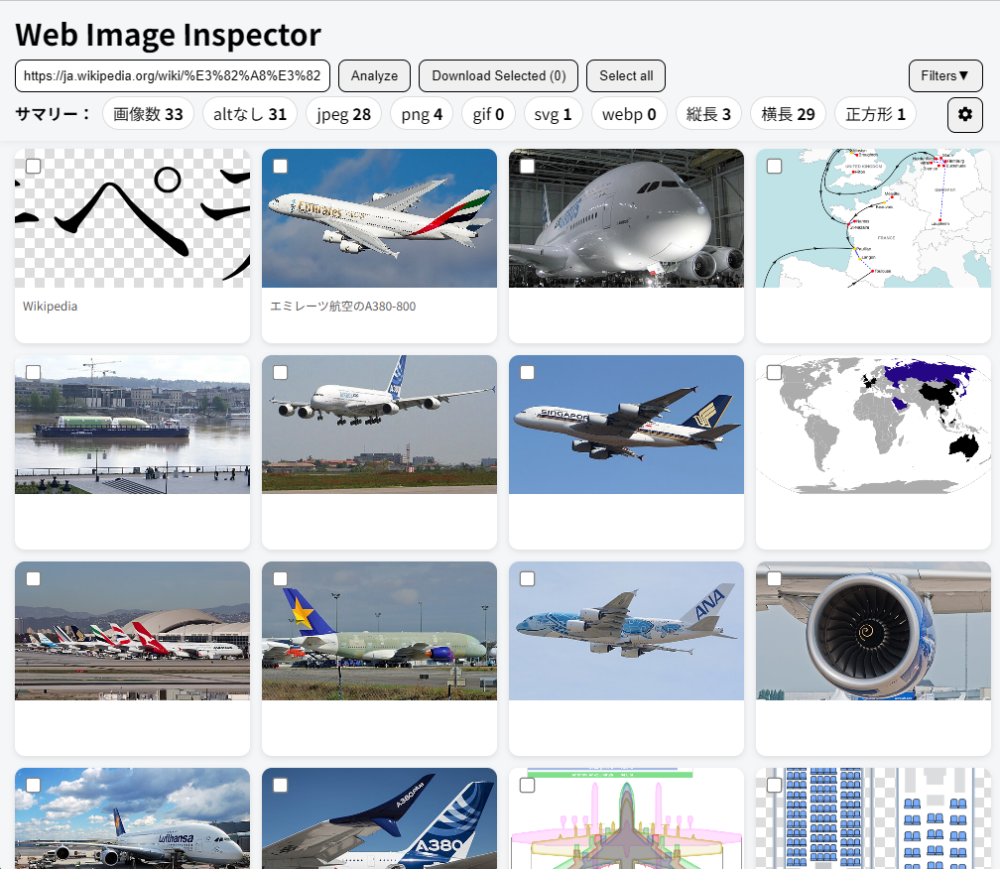
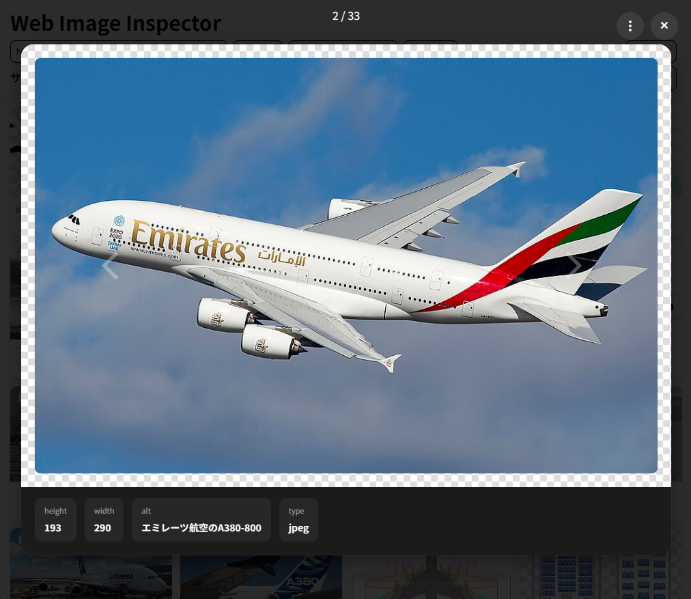

# Web Image Inspector

Webページ内の画像を解析し、
alt属性・画像形式・アスペクト比などを可視化できるツールです。

SEOやアクセシビリティの確認、
画像管理やWeb制作時のチェック用途を想定しています。

## Features

- URLを指定してページ内画像を解析
- alt属性の有無を確認
- JPEG / PNG / GIF / WEBP / AVIF を判定
- 縦長 / 横長 / 正方形の分類
- 画像一覧表示
- 画像プレビュー
- 複数画像の一括ダウンロード
- フィルタリング機能
- サマリー表示

## Screenshot

## Tech Stack

### Frontend

- React
- TypeScript
- Vite
- Material UI

### Backend

- FastAPI
- BeautifulSoup4
- Requests

## Motivation

Webページ内の画像を確認したい場面では、
ブラウザの開発者ツールだけでは一覧性が低く、
alt属性や画像形式の確認にも手間がかかります。

そのため、画像情報をまとめて分析できるツールとして開発しました。

## Roadmap

- 設定画面の強化
- 画像メタデータ表示
- 画像サイズ分析
- ダークモード
- PWA対応
